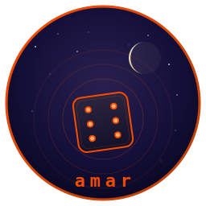
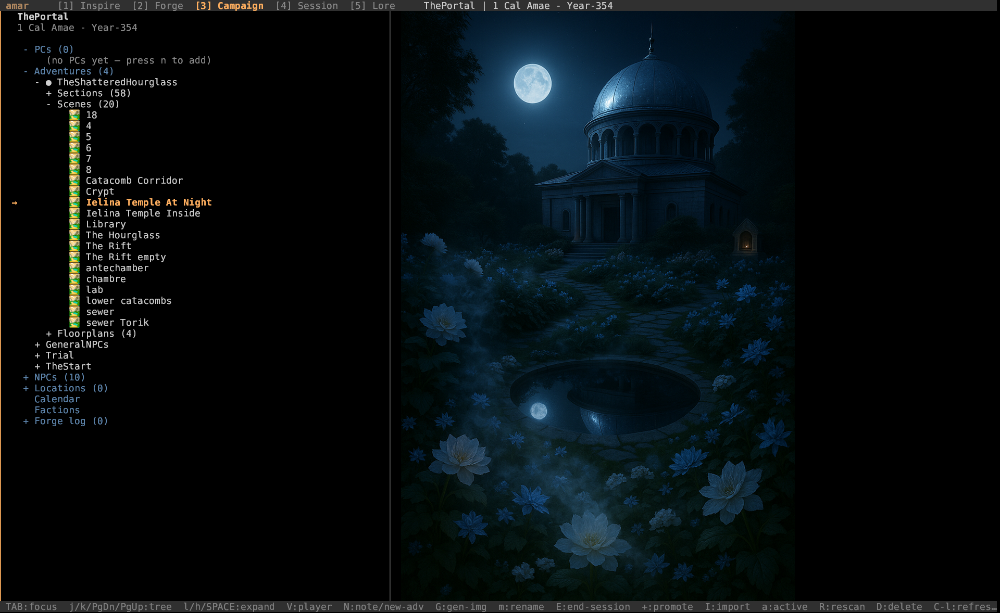
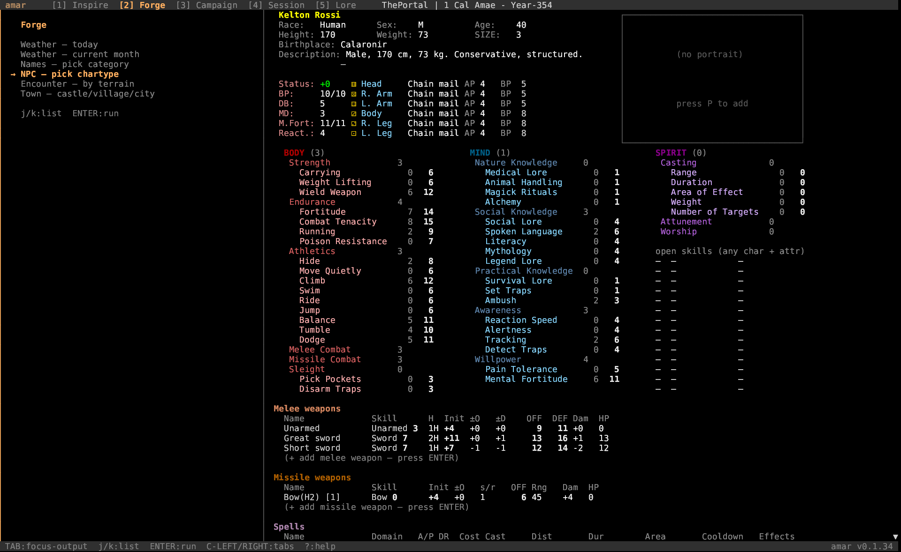
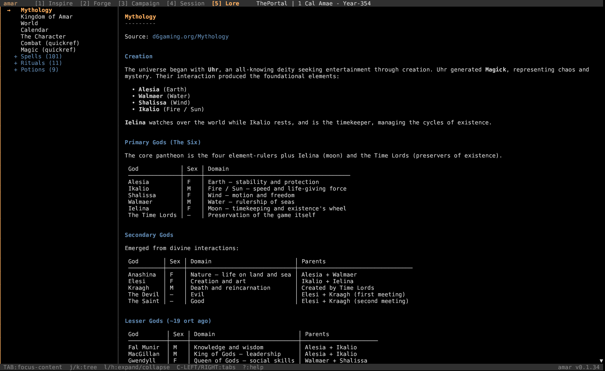
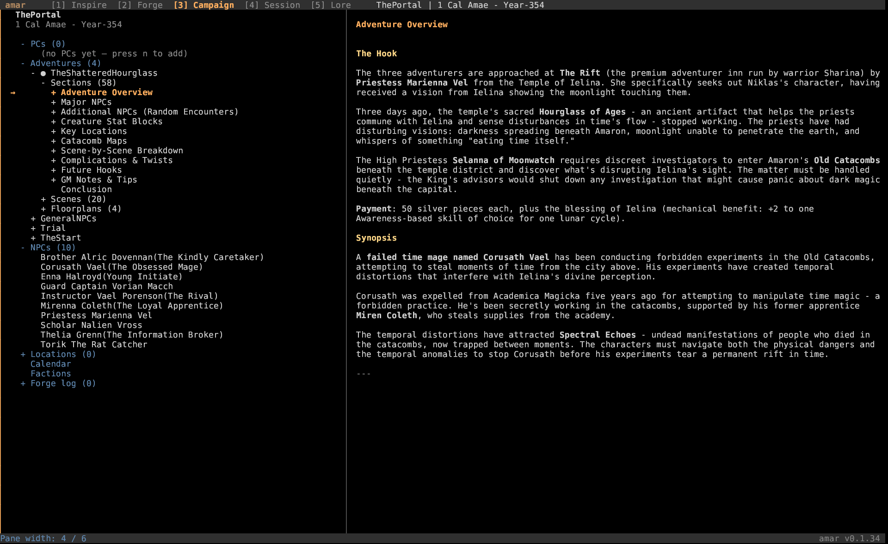

# amar



**The Amar RPG companion. Written in Rust.**

      

Terminal companion for the **[Amar RPG](https://d6gaming.org)** — Geir Isene's three-tier d6 system (O6). Five-tab TUI: a Forge for NPCs / encounters / towns / weather, a persistent Campaign tracker with adventure import and scene images, a live Session HUD, browsable Lore from the canon wiki, and AI-assisted Inspire prompts. Built on [crust](https://github.com/isene/crust) (TUI) and [glow](https://github.com/isene/glow) (kitty graphics).

Part of the [Fe₂O₃ Rust terminal suite](https://github.com/isene/fe2o3).

## Screenshots

| Campaign tab — adventure tree with inline scene image |
|:---:|
|  |
| *Selina's temple at moonlit night, rendered next to the adventure's nested section tree.* |

| Forge tab — full NPC sheet (3-tier d6 system) |
|:---:|
|  |
| *Generated NPC with characteristics, attributes, skills, derived stats, melee & missile weapons, equipment.* |

| Lore tab — d6gaming.org canon, locally browsable |
|:---:|
|  |
| *Mythology: creation, the Six, secondary and lesser gods — sourced from the wiki, no internet required.* |

| Campaign tab — adventure overview |
|:---:|
|  |
| *Imported adventure synopsis with auto-extracted scenes, NPCs, floorplans, and complications.* |

## Features

- **5-tab TUI**
  - **Inspire** — AI-assisted brainstorming via `claude -p`
  - **Forge** — generators for NPCs, encounters, towns, weather; saved-library with `S`
  - **Campaign** — persistent PCs, NPCs, locations, factions, adventures, calendar
  - **Session** — live combat HUD, party tracker, session log
  - **Lore** — browsable canon: mythology, kingdom, world, calendar, spells, rituals, potions
- **3-tier d6 character system** (Char + Attribute + Skill = Total) honored throughout
- **187 wiki entries** scraped from d6gaming.org (spells / rituals / potions), bundled offline
- **Adventure import**: point at a directory, amar walks `*.md` + `Scenes/` + `Floorplans/` + `NPCs/`, parses heading-level sections, auto-attaches scene images to their sections
- **Inline kitty graphics** via [glow](https://github.com/isene/glow) — scene images, NPC portraits, floorplans, all in-pane
- **Player display** — push the current image to a separate window with `V` (uses `feh --class amar-player`, so your WM rules pick where it lands)
- **Scene image generation** — `G` on a section invokes DALL-E 3 / Imagen and drops the result into `Scenes/` for auto-attach on rescan
- **NPC portraits** — auto-generated per NPC, cached per campaign
- **Combat HUD** — j/k to cycle combatants, ±/M/m to track HP/MF, `o`/`O` for skill / combat O6 rolls with crit/fumble tables
- **Three concentric circles of canon** — wiki canon (read-only), author canon (gap-filling additions), campaign canon (per-user)
- **Saved Forge library** — every generated NPC / encounter / town / weather can be persisted to the campaign with `S`
- **Auto-promote** — when an encounter NPC joins the party, `+` upgrades to a full editable NPC sheet (defaults to NPC, press `p` for PC)
- **Pointer-style navigation** — `j/k` tree, `SPACE`/`l` expand, `h` collapse, `PgUp`/`PgDn`, `Ctrl+L` hard refresh, `c` rename
- **Encumbrance** — armor m_mod offset by Strength + Wield Weapon, Status penalty calculated per Amar rules

## Install

Build from source:

```bash
git clone https://github.com/isene/amar
cd amar
cargo build --release
cp target/release/amar ~/.local/bin/
```

Or symlink for live rebuilds:

```bash
ln -s "$(pwd)/target/release/amar" ~/bin/amar
```

## Quick start

```bash
amar                                   # opens last-active campaign (or onboarding)
amar --create-campaign MyCampaign      # bootstrap a fresh campaign
amar --import MyCampaign ~/path/to/dir # import an adventure into a campaign
amar --rescan-all                      # re-scan every adventure's on-disk root
```

Press `?` for the in-app help. Press `q` to quit (saves campaign + config).

## Key bindings (essentials)

### Global

| Key | Action |
|-----|--------|
| 1-5 | Jump to tab (Inspire / Forge / Campaign / Session / Lore) |
| Ctrl-←/→ | Previous / next tab |
| TAB | Toggle focus between left and right pane |
| ESC | Drop focus back to left pane / clear status line |
| w / W | Cycle left-pane width |
| Ctrl-L | Hard refresh |
| r | Redraw |
| ? | Help popup |
| q / Q | Quit (saves) |

### Campaign tab

| Key | Action |
|-----|--------|
| C / L / X | Create / load / delete a campaign |
| D | Delete the PC, NPC, or saved-forge entry under the cursor |
| + | Promote NPC → roster (default NPC; press `p` for PC list) |
| I | Import an adventure directory into the campaign |
| N | On Adventures header → scaffold new adventure; on a section row → append session note |
| a | Mark cursor adventure as ACTIVE (persists between sessions) |
| R | Re-scan adventure root for new scenes / NPCs / .md edits |
| V | Push cursor image to player display (`feh --class amar-player`) |
| G | Generate scene image for the cursor section |
| E | End current session — writes banner + advances section pointer |
| c | Rename file under cursor (pointer convention) |
| t | Tag for combat: PC/NPC → binary toggle; saved encounter → tag next inner NPC (press 9 times for 9 rats) |
| T | Untag: PC/NPC → remove if tagged; saved encounter → drop highest-indexed tagged NPC |

### Lore tab

| Key | Action |
|-----|--------|
| j / k | Tree cursor down / up |
| ENTER / l | Expand canon category |
| h | Collapse / jump to parent |
| SPACE | Toggle collapse |
| g / G | First / last item |
| PgUp / PgDn | Page scroll content |

### Session tab (combat HUD)

| Key | Action |
|-----|--------|
| j / k | Select combatant |
| + / − | Damage / heal current HP |
| M / m | MF up / down (mental fortitude — spell cost, willpower hits) |
| A | Add all PCs to the fight |
| a | Add one PC or NPC by name substring |
| d | Remove selected combatant |
| c | Clear the HUD |
| o / O | Private skill / combat O6 rolls (status line) |

### Forge tab

| Key | Action |
|-----|--------|
| 1-4 | NPC / Encounter / Town / Weather |
| ENTER | Re-roll |
| S | Save to campaign library |
| + | Promote to roster (NPC or PC) |

## Data layout

```
~/.amar/
├── config.toml                      # active campaign + global prefs
└── campaigns/
    └── <name>/
        ├── campaign.json            # PCs, NPCs, locations, factions, saved-forge, adventures, calendar
        ├── session.log              # append-only session journal
        ├── portraits/               # NPC portrait cache
        └── adventures/<adventure>/
            ├── <Adventure>.md       # GM notes, headings → section tree
            ├── Scenes/              # scene images (auto-attached by heading match)
            ├── Floorplans/          # maps and floorplans
            └── NPCs/                # NPC docs + portraits for this adventure
```

## Canon pipeline

All Amar mechanics — spells, rituals, potions, weapons, armor, formulas — come from **[d6gaming.org](https://d6gaming.org)**. The wiki is the source of truth; amar never invents canonical rules.

`scripts/` and `src/bin/scrape_canon.rs` hold the canon scraper:

```bash
cargo run --release --features scraper --bin scrape_canon
```

It reads from d6gaming.org via `?action=raw` (wikitext export), parses the `{{infobox}}` of every spell / ritual / potion page, and writes `data/canon.toml`. Each entry carries its source URL so any value can be verified against the wiki by hand.

When the wiki changes, re-run the scraper. The TOML is committed to the repo so amar runs without internet access.

## Three concentric circles of canon

1. **Wiki canon** — `data/canon.toml`, scraped from d6gaming.org. Verified, source-linked. The TUI never modifies this file.
2. **Author canon** — `data/death_spells.toml`, `data/magic_items.toml`, `data/monsters.toml` and similar. Hand-authored entries that fill gaps the wiki has not yet covered. Marked `source = "amar-author"` so they are visually distinct in the Lore tab.
3. **Campaign canon** — `~/.amar/campaigns/<name>/`. Per-user, per-campaign data: PCs, NPCs, locations, adventures, session logs, calendar.

## Part of the Rust Terminal Suite (Fe₂O₃)

See the [Fe₂O₃ suite overview](https://github.com/isene/fe2o3) and the [landing page](https://isene.org/fe2o3/) for the full list.

| Tool | Clones / Origin | Type |
|------|-----------------|------|
| [rush](https://github.com/isene/rush) | [rsh](https://github.com/isene/rsh) | Shell |
| [crust](https://github.com/isene/crust) | [rcurses](https://github.com/isene/rcurses) | TUI library |
| [glow](https://github.com/isene/glow) | [termpix](https://github.com/isene/termpix) | Image display |
| [pointer](https://github.com/isene/pointer) | [RTFM](https://github.com/isene/RTFM) | File manager |
| [kastrup](https://github.com/isene/kastrup) | [Heathrow](https://github.com/isene/heathrow) | Messaging |
| [tock](https://github.com/isene/tock) | [Timely](https://github.com/isene/timely) | Calendar |
| [scroll](https://github.com/isene/scroll) | [brrowser](https://github.com/isene/brrowser) | Browser |
| **[amar](https://github.com/isene/amar)** | **Amar-Tools (Ruby)** | **RPG companion** |

## Dependencies

**Build**: Rust toolchain (cargo, 2021 edition)

**Runtime** (optional, for full features):
- `ImageMagick` (`convert`) for kitty graphics / image scaling
- A kitty-protocol-capable terminal (kitty, wezterm, ghostty) for inline images
- `feh` for player display (`V` key)
- `claude` CLI for the Inspire tab
- `OPENAI_API_KEY` (`/home/.safe/openai.txt` convention) for DALL-E scene / portrait generation
- `GEMINI_API_KEY` for Imagen scene generation (alternative)

## License

[Unlicense](https://unlicense.org/) — public domain.

## Credits

Created by Geir Isene (<https://isene.org>) with extensive pair-programming with Claude Code. The Amar RPG world, mythology, and 3-tier d6 system are also Geir Isene's, documented at <https://d6gaming.org>.
